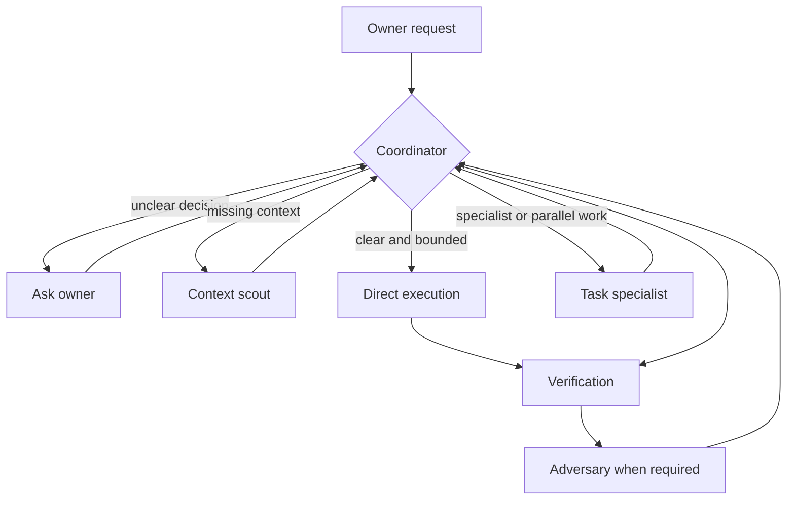
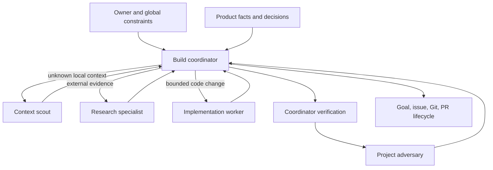
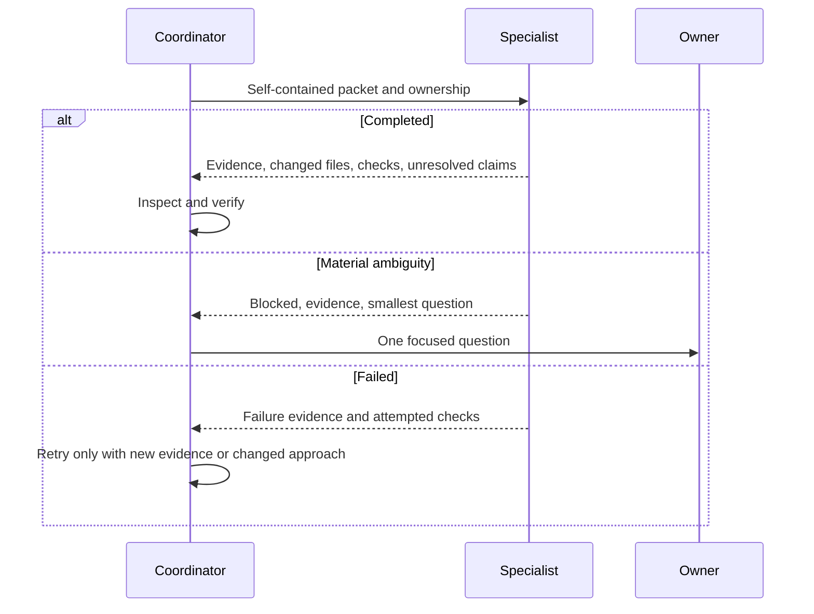

# OpenCode Orchestration Mesh - Plan

## Goal Capsule

- **Objective:** OpenCode gives its owner a pleasant, low-friction experience by selecting the right context, skill, tool, subagent, and model effort for each task while preserving maximum available capability.
- **Means:** Introduce a bounded orchestration mesh with selective context routing and a small set of task-shaped roles.
- **Product authority:** The owner sets intent and resolves ambiguity. This standards repository owns portable team behavior, while the global OpenCode setup owns personal and cross-repository orchestration.
- **Open blockers:** None.
- **Execution profile:** Apply repository changes test-first, apply machine-local configuration separately, then verify the merged OpenCode runtime before shipping repository changes.
- **Tail ownership:** LFG owns review, repository commit, push, pull request creation, and CI watch. Machine-local configuration remains outside the repository commit.

---

## Product Contract

The Product Contract below preserves the meaning and stable IDs confirmed during brainstorming. Planning details cite it without changing its scope.

### Summary

OpenCode will use a bounded orchestration mesh that keeps Compound Engineering as the primary workflow system, routes only relevant context and capabilities to each agent, and delegates clear work automatically. Shared product standards and personal orchestration will remain separate.

### Problem Frame

The current setup has not produced a specific failure that needs remediation. This work is a proactive refinement intended to improve the experience, token efficiency, and task-to-capability matching without trading away intelligence.

The shared harness is already intentionally thin and OpenCode-only, with on-demand procedures, one adversarial reviewer, and a retro loop. The global setup provides a much broader capability catalog through Compound Engineering, Superpowers, and shared skills, but it has no bounded specialist mesh or selective capability ownership. Adding more undifferentiated agents would increase routing ambiguity and maintenance rather than improve the experience.

### Key Decisions

- **Compound Engineering remains the primary workflow system** (session-settled: user-directed, chosen over competing workflow defaults because the owner explicitly values its approach). Governs R6, R9.
- **Global and shared concerns stay separate** (session-settled: user-directed, chosen over a blended setup because personal orchestration must not leak into product templates). Governs R1, R2.
- **All capabilities remain installed** (session-settled: user-directed, chosen over aggressive pruning because capability breadth is part of the desired experience). Governs R8.
- **Delegation is automatic when work is clear** (session-settled: user-directed, chosen over explicit invocation because low-friction orchestration is a core outcome). Governs R4, R5.
- **Unclear intent returns to the owner** (session-settled: user-directed, chosen over silent inference because the agent must ask whenever a material decision is unclear). Governs R10, R11.
- **Use a bounded mesh** (session-settled: user-directed, chosen over a navigation-only layer or capability broker because the setup should be neither too thin nor too heavy). Governs R3-R9.

### Actors

- A1. **Owner:** Defines intent, answers material questions, and judges whether the setup feels pleasant and capable.
- A2. **Coordinator:** Owns task understanding, routing, delegation, synthesis, and the final result.
- A3. **Context scout:** Locates authoritative constraints, implementation patterns, and relevant examples without proposing or editing.
- A4. **Task specialist:** Executes a bounded implementation, research, testing, or domain-specific assignment with only the capabilities it needs.
- A5. **Adversary:** Independently reviews completed work under the existing standards contract.

### Requirements

**Layer ownership and context**

- R1. Shared harness behavior must contain only project-agnostic team constraints and procedures, while personal routing, provider, model, and cross-repository preferences remain global.
- R2. Context routing must apply this precedence when sources disagree: product facts and named deviations, accepted product decisions and design authority, the pinned shared playbook, then inferred code patterns.
- R3. The system must discover relevant context before broad reading and pass agents targeted paths, line references, and reasons for relevance instead of loading complete context trees by default.

**Orchestration**

- R4. The coordinator must choose direct execution or delegation from task complexity, independence, specialist need, risk, and expected context cost rather than a fixed file-count threshold.
- R5. Clear independent work should be delegated automatically and in parallel when useful, while the coordinator prevents overlapping ownership and remains responsible for synthesis.
- R6. Every delegated assignment must be self-contained and state its goal, in-scope work, out-of-scope work, completion criteria, and return contract.
- R7. The durable role set must stay small and task-shaped, with one owner per responsibility and no subagent-to-subagent coordination dependency.

**Capability and effort routing**

- R8. Every installed capability must remain reachable, but each agent should see only role-relevant skills whose required primitive tools it can use so overlapping or unusable workflows do not compete implicitly.
- R9. Compound Engineering must own planning, implementation, review, and shipping workflows where it provides a matching procedure; adjacent skill suites remain available for capabilities it does not own.
- R10. The coordinator must start with the least expensive route that can complete the task well and escalate context, tools, model effort, or specialist involvement when complexity, uncertainty, or risk warrants it.

**Owner interaction and continuity**

- R11. The coordinator must ask the owner before proceeding whenever requirements, intent, trade-offs, or consequential choices remain unclear after inspecting available facts.
- R12. The coordinator must not ask for confirmation on clear, routine, reversible work or use ambiguity handling as a universal approval gate.
- R13. The mesh must reuse native conversation compaction, goal state, plans, and existing handoff artifacts rather than create a parallel persistent session-manifest system.
- R14. Existing adversary review and retro behavior must remain authoritative and integrate with the mesh rather than be duplicated by new review or learning agents.

**Evaluation and evolution**

- R15. The first version must be evaluated on a representative set of real tasks using experience, usage, routing quality, unnecessary-question, and correction signals before the mesh expands.
- R16. Future roles, rules, or hooks must be added only when trial evidence or the existing retro process identifies a durable gap.

The routing relationship is:

### Key Flows

- F1. **Task intake and routing**
  - **Trigger:** A1 gives A2 a request.
  - **Actors:** A1, A2, and A3 when context is missing.
  - **Steps:** A2 inspects available facts, asks A1 about any remaining material ambiguity, loads targeted context, and chooses direct execution or delegation.
  - **Outcome:** Work starts with sufficient clarity and the smallest capable route.
  - **Covers:** R2-R5, R10-R12.
- F2. **Delegated execution**
  - **Trigger:** A2 identifies independent, specialist, or context-heavy work.
  - **Actors:** A2, A3, and one or more A4 roles.
  - **Steps:** A2 assigns non-overlapping slices with explicit contracts, runs independent slices in parallel when useful, and synthesizes their outputs into one result.
  - **Outcome:** Delegation improves capability or efficiency without fragmenting ownership.
  - **Covers:** R3-R8.
- F3. **Verification and learning**
  - **Trigger:** Work reaches its applicable completion gate or exposes a durable miss.
  - **Actors:** A2, A5, and A1 when a decision is needed.
  - **Steps:** A2 verifies the result, invokes A5 under the existing review contract when required, resolves findings, and uses the retro process only for durable harness gaps.
  - **Outcome:** The coordinator returns a verified result and the harness evolves from evidence.
  - **Covers:** R11, R14-R16.

### Acceptance Examples

- AE1. **Clear small task stays direct.** Covers R4, R10, R12. Given a well-scoped one-file correction with an obvious verification path, when A2 routes the work, then it executes directly without asking permission or dispatching a specialist.
- AE2. **Unknown codebase area starts with discovery.** Covers R2-R6. Given a task whose relevant implementation is unknown, when A2 routes the work, then A3 returns targeted locations and evidence before A2 assigns or performs implementation.
- AE3. **Independent research runs in parallel.** Covers R5-R7. Given two research questions that share no state, when A2 delegates them, then separate agents own each question concurrently and A2 alone synthesizes the result.
- AE4. **Material ambiguity blocks invention.** Covers R11, R12. Given two plausible interpretations that change product behavior, when available project facts do not resolve them, then A2 asks A1 one focused question before proceeding.
- AE5. **Capability remains available without universal exposure.** Covers R8, R9. Given a niche task that needs an installed specialist skill, when A2 routes it, then the appropriate role can use that skill even if unrelated agents do not see it.
- AE6. **Source conflict follows authority.** Covers R2. Given an inferred code pattern that conflicts with an accepted product decision, when an agent receives context, then the accepted decision governs and the conflict is surfaced rather than silently resolved toward the code pattern.
- AE7. **Escalation preserves quality.** Covers R10. Given a low-cost route that cannot verify a high-risk conclusion, when A2 detects the gap, then it escalates the necessary context, tool, specialist, or model effort and records why.

### Success Criteria

- The owner completes representative tasks without repeatedly naming the relevant standards, skill, tool, or subagent.
- Clear tasks proceed without unnecessary interruption, while material ambiguity produces a focused owner question before assumptions become work.
- Delegated work has non-overlapping ownership, structured returns, and one coordinator-authored synthesis.
- Task trials show lower or equivalent usage than the current setup without reducing verification quality or available capability.
- A cold reviewer can explain why a task ran directly, delegated, or escalated from the routing evidence.
- The shared template contains no personal provider or model preferences, and the global layer does not duplicate shared product constraints.

### Scope Boundaries

- Do not replace or substantially rewrite Compound Engineering.
- Do not remove installed skills or capability providers as part of the first version.
- Do not require approval before routine reads, commands, edits, or delegation.
- Do not add persistent session manifests, a document for every workflow phase, or another harness tree.
- Do not copy the reference projects' generic coding standards, full agent catalogs, file-count delegation thresholds, or subagent-to-subagent coordination patterns.
- Do not add roles, rules, or hooks solely for theoretical completeness.

### Dependencies and Assumptions

- OpenCode continues to support per-agent skill permissions, subagent modes, references, and project-over-global configuration merging.
- Compound Engineering remains installed and available as the primary workflow suite.
- The owner accepts qualitative experience signals during the first trial because there is no observed-failure baseline.
- Product repositories continue to pin this standards repository and keep product-specific authority in their own docs.

### Sources and Research

- `docs/harness.md`
- `docs/adr/0001-opencode-only-harness.md`
- `templates/harness/opencode.json`
- `templates/harness/.opencode/rules/workflow.md`
- `templates/harness/.opencode/agent/adversary.md`
- `templates/harness/.opencode/skills/retro/SKILL.md`
- [OpenAgentsControl](https://github.com/darrenhinde/OpenAgentsControl)
- [Cluster444 agentic agent guide](https://github.com/Cluster444/agentic/blob/master/docs/agents.md)
- [OpenCode skills documentation](https://opencode.ai/docs/skills/)

---

## Planning Contract

### Key Technical Decisions

- KTD1. **Use the existing `build` agent as coordinator.** (session-settled: user-directed - chosen over a navigation-only layer or capability broker: the owner selected a bounded orchestration mesh.) Add three machine-local roles named `context-scout`, `research-specialist`, and `implementation-worker`; retain the project-owned `adversary`. This implements R4-R9 without creating another workflow suite.
- KTD2. **Resolve authority by concern, not config load order.** Global owner authorization, safety, secrets, provider choices, and model choices are outer constraints. Product facts, accepted product decisions, design authority, workflow, and quality gates govern work inside those constraints. Unresolved semantic conflict takes the non-destructive route and returns one focused question to the owner. This implements R1, R2, R11, and R12.
- KTD3. **Combine static role ceilings with dynamic assignment scope.** Each specialist starts from deny-by-default permissions and receives explicit role allows with no effective `ask` fallback. Sensitive external paths and lifecycle actions stay denied, and shell access is limited to the exact commands needed by the role. Every dispatch packet further narrows that ceiling with owned files or concerns, relevant context, allowed actions, checks, and stop conditions. Packet scope is an operating contract, not a native sandbox, so the coordinator must inspect returned evidence and the worktree. This implements R3, R6-R8, and R11.
- KTD4. **Keep orchestration and lifecycle authority with the coordinator.** Subagents use `completed`, `blocked`, or `failed` returns and cannot delegate, ask the owner, update goal or issue state, commit, push, open pull requests, or declare final completion. The coordinator alone fans out work, synthesizes results, inspects the combined diff, reruns integration checks, and changes lifecycle state. This implements R5-R7 and R14.
- KTD5. **Allow concurrency only across independent ownership.** Agents share the worktree but not conversational context. Concurrent mutating assignments require file-exclusive ownership and no result dependency. Concern-only parallelism is limited to read-only work; every same-file edit is serialized or repartitioned. This implements R5-R7.
- KTD6. **Keep personal model policy global.** Shared templates require configured review routing but contain no provider IDs, aliases, effort variants, or personal streak policy. The global layer selects lower-cost discovery and research routes, a high-effort implementation route, and the owner's adversary model. This implements R1 and R10.
- KTD7. **Preserve coordinator capability breadth in version one.** Keep all installed providers, plugins, skills, MCPs, and built-in agents. Do not add a coordinator task allowlist or repurpose `general` or `explore`; specialist-local denials create isolation without hiding Compound Engineering personas from the coordinator. This implements R8 and R9.
- KTD8. **Use native continuity and lightweight trial evidence.** Record route, reason, agent or skill, questions, corrections, verification outcome, and native usage in the pull request notes. Record names, permission outcomes, and hashes instead of raw resolved configuration. Redact and secret-scan every excerpt before publication. Do not add a session manifest or permanent routing log. This implements R13, R15, and R16.
- KTD9. **Scope coordinator-only policy to `build`.** Keep global `AGENTS.md` limited to instructions that apply to every agent. Put routing, delegation, synthesis, and lifecycle policy in a global `build` agent override so specialists do not inherit contradictory coordinator instructions. This implements R4-R9 and R12.

### High-Level Technical Design

### Implementation Constraints

- The repository target is this standards repository. Its paths are listed relative to the repository root.
- The machine-local target root is `~/.config/opencode`. Paths in machine-local units are relative to that root and must not enter the repository commit.
- Keep `templates/harness/opencode.json`, `scripts/stamp.sh`, the accepted OpenCode-only ADR, and the existing retro skill unchanged unless execution finds invalidating evidence.
- Use the canonical global `agents/` directory, but retain the accepted singular project `.opencode/agent/` directory.
- Reserve the `context-scout`, `research-specialist`, and `implementation-worker` names for the machine-local mesh. A project-local definition with one of those names is a collision: do not delegate to it until the coordinator inspects the merged definition and restores the global ceiling.
- Do not add a live global reference to the standards checkout. Product repositories continue to use their pinned and stamped playbook.
- Do not print resolved configuration or file-backed secret values during validation.

### Assumptions

These are non-blocking implementation defaults inferred in the headless planning run and must be validated during execution:

- Three new global specialists are the smallest role split that provides useful capability isolation without duplicating Compound Engineering.
- `context-scout` needs repository read, search, and language-server access but no skills, shell mutation, owner interaction, or delegation.
- `research-specialist` needs retrieval-only research, documentation, and extraction capabilities plus only the shell commands those skills require. Interactive, authenticated, or state-changing browser automation stays with the coordinator.
- `implementation-worker` needs workspace edits, scoped checks, and implementation or domain skills, but no planning, review, shipping, orchestration, or lifecycle skills.
- The existing `openai/gpt-5.6-luna` medium route is suitable for context discovery. The existing `openai/gpt-5.6-luna-fast` route is suitable for research and implementation, with medium effort for research and maximum effort for implementation.
- A global `adversary` override can supply the personal review model and read-only permission ceiling while the project file supplies the review prompt.
- OpenCode's documented last-match permission behavior and global/project agent merge produce the intended effective restrictions. Runtime inspection must prove both before the configuration is accepted.

### System-Wide Impact

- **Developers:** Product repositories receive clearer source authority and no longer inherit one owner's review provider choices.
- **Owner:** The global coordinator gains automatic task-shaped delegation while retaining access to every installed capability.
- **Agent runtime:** Specialist prompts and permissions reduce context and tool exposure; the coordinator retains synthesis and lifecycle authority.
- **Existing workflows:** Compound Engineering, the stamped adversary, Linear-first workflow, quality gates, and retro remain the canonical owners of their current responsibilities.

### Risks and Mitigations

| Risk | Mitigation |
|---|---|
| Global `permission: "allow"` leaks mutation capability into a specialist | Close inherited core, plugin, MCP, question, task, shell-lifecycle, and goal-lifecycle access with KTD3, then inspect the resolved agent definition. |
| Skill allowlists omit a newly installed capability | Keep all skills visible to the coordinator and treat specialist lists as role routing aids rather than the only route to a capability. |
| A broad worker recreates the current undifferentiated catalog | Exclude planning, review, shipping, orchestration, and lifecycle skills from the implementation worker. |
| Shared-worktree concurrency causes conflicting edits | Parallelize only non-overlapping ownership, inspect the combined diff, and rerun integration checks. |
| Global and project prose disagree | Apply KTD2 and ask the owner when concern-based authority does not resolve the conflict. |
| Project configuration redefines a reserved specialist name | Detect the collision before delegation, inspect the merged definition, and refuse the role while any global denial is reopened. |
| An allowed shell command or subprocess reads ambient credentials | Remove workspace reads from research, deny shell composition, use a dedicated scratch directory, use a narrow worker command list, deny sensitive external paths, and treat the remaining process-level exposure as a reviewed machine-local risk. |
| Runtime merge behavior differs from documentation | Treat agent-resolution smoke checks as a release gate and revert only this change's invalid local configuration if a role resolves unsafely. |
| Proactive optimization adds ceremony without benefit | Run the representative trial and remove or narrow roles that do not improve routing, usage, or experience. |

### Sequencing

1. Add repository boundary assertions so provider leakage and missing authority guidance fail before templates change.
2. Update shared rules, adversary contract, and documentation until the stamping contract passes.
3. Capture the pre-change global capability inventory, then update the global coordinator contract and depth setting without removing existing capabilities.
4. Add restricted specialists and the global adversary override.
5. Validate the merged runtime, run representative routing trials, and keep machine-local changes outside the repository commit.

---

## Implementation Units

### U1. Enforce the shared and personal boundary

- **Goal:** Make the stamped harness prove that source authority is present and personal orchestration details are absent.
- **Requirements:** R1-R3, R14; supports AE2 and AE6.
- **Dependencies:** None.
- **Files:**
  - Modify `tests/stamp_test.sh`.
  - Modify `templates/harness/.opencode/rules/product.md`.
  - Modify `templates/harness/.opencode/rules/workflow.md`.
  - Modify `templates/harness/.opencode/agent/adversary.md`.
- **Approach:**
  1. Add failing stamping assertions for the product rule, source-order language, valid `opencode.json`, absence of personal provider strings, and absence of global specialist files.
  2. Add source authority, targeted context discovery, conflict surfacing, and material-ambiguity behavior to the existing product rule per KTD2.
  3. Remove provider IDs, aliases, effort choices, and personal streak policy from the shared workflow and adversary while preserving the review method, verdict schema, severity gate, and configured-pin requirement per KTD6. Repository reviews identify a committed SHA; machine-local review bundles identify a complete hash set and runtime identity.
  4. Replace generic actor language for commits, pushes, review dispatch, and readiness with coordinator or parent ownership per KTD4.
- **Execution note:** Start with failing assertions for the shared-boundary contract, then make the smallest template edits that pass them.
- **Patterns to follow:** Existing fixture creation and artifact assertions in `tests/stamp_test.sh`; one-job-per-artifact guidance in `templates/harness/.opencode/rules/workflow.md`; existing adversary output contract.
- **Test scenarios:**
  - Covers AE2. Stamp a fixture and verify the product rule contains targeted context-discovery guidance.
  - Covers AE6. Stamp a fixture and verify the authority order places accepted product decisions above inferred code patterns.
  - Stamp a fixture and verify neither `xai/grok-4.6` nor `cursor/grok-4.6` appears anywhere in the shared harness.
  - Stamp a fixture and verify no `context-scout`, `research-specialist`, or `implementation-worker` role is shipped.
  - Stamp a fixture and verify existing placeholder and retired-harness checks still pass and `opencode.json` parses as JSON.
- **Verification:** The fixture contains the revised shared contracts, contains no personal model policy or global role, and all existing stamping guarantees remain intact.

### U2. Document the two-layer operating model

- **Goal:** Make shared versus machine-local ownership clear to future maintainers without creating another process artifact.
- **Requirements:** R1-R3, R9, R13-R16.
- **Dependencies:** U1.
- **Files:**
  - Modify `docs/harness.md`.
- **Approach:** Document the concern-based authority order, targeted context behavior, machine-local coordinator and specialist ownership, continued use of product pins, and the explicit decision not to stamp mesh roles or personal models.
- **Patterns to follow:** The existing thin-harness and OpenCode-only explanations in `docs/harness.md`; the accepted boundary in `docs/adr/0001-opencode-only-harness.md`.
- **Test scenarios:** Test expectation: none - this unit documents behavior enforced by U1 and runtime checks in U5.
- **Verification:** A maintainer can identify which layer owns each mesh concern and why live global standards references and stamped specialists are excluded.

### U3. Define global coordinator policy

- **Goal:** Make `build` an accountable CE-first coordinator that routes clear work automatically and asks only for material unresolved decisions.
- **Requirements:** R2-R14; supports F1-F3 and AE1-AE7.
- **Dependencies:** U1.
- **Files:**
  - Modify global `AGENTS.md`.
  - Modify global `opencode.jsonc`.
  - Create global `agents/build.md`.
- **Approach:**
  1. Record pre-change agent and skill name inventories before modifying global configuration.
  2. Keep only universally applicable source-authority, safety, and delegation-boundary rules in global `AGENTS.md`.
  3. Define the `build`-specific CE-first routing contract in `agents/build.md`: direct-versus-delegate factors, dependent and parallel slice rules, the complete dispatch packet, return statuses, retry limits, coordinator verification, and lifecycle ownership per KTD9.
  4. Move the personal adversary model and effort policy out of shared templates and into the global layer per KTD6.
  5. Set `subagent_depth` to one and add only the global adversary model and permission override needed by KTD4 and KTD6.
  6. Preserve every existing provider, plugin, skill path, MCP, model setting, and coordinator capability per KTD7.
- **Execution note:** Treat this as machine-local configuration. Preserve all unrelated global content and avoid commands that print resolved secret values.
- **Patterns to follow:** Existing global prompt packet headings; current model definitions in global `opencode.jsonc`; OpenCode config schema and permission ordering.
- **Test scenarios:**
  - Covers AE1. A clear reversible one-file request remains direct and asks no confirmation question.
  - Covers AE4. A consequential unresolved product choice produces one coordinator question, while a subagent can only return the ambiguity.
  - A project quality gate can require further adversary review, while the same failure twice changes approach or returns a focused question.
  - Explicit owner authorization remains required for push and pull request actions even if a project workflow permits them.
- **Verification:** The JSONC parses, the resolved `build` agent retains its complete skill and task surface, nested delegation is capped, and the effective adversary is read-only with the configured personal model.

### U4. Add bounded global specialists

- **Goal:** Add task-shaped roles whose prompts, skills, tools, and permissions match their responsibilities.
- **Requirements:** R3-R10; supports F1, F2, AE2, AE3, AE5, and AE7.
- **Dependencies:** U3.
- **Files:**
  - Create global `agents/context-scout.md`.
  - Create global `agents/research-specialist.md`.
  - Create global `agents/implementation-worker.md`.
- **Approach:**
  1. Define each role as a subagent with a deny-by-default static ceiling per KTD3 and no nested task, owner-question, or goal-lifecycle access per KTD4.
  2. Give the scout a WHERE/HOW/EXAMPLE evidence contract with paths, line references, relevance, callers, and unresolved ambiguity.
  3. Give the research role only retrieval and documentation skills plus `webfetch` and reviewed, version-pinned `ctx7` and `parallel-cli` commands. Exclude interactive browser, monitor, upload, authenticated-account, shell-composition, and workspace-read capabilities.
  4. Give the worker implementation and domain skill families, workspace edit access, and scoped check execution while denying workflow, review, commit, PR, shipping, and lifecycle capabilities.
  5. Require every role to return status, owned scope, evidence, changed files when applicable, checks with observed results, unresolved ambiguity, blockers, and claims the coordinator must verify.
- **Execution note:** Use runtime smoke verification instead of unit tests because these are declarative agent profiles.
- **Patterns to follow:** Existing global agent frontmatter conventions; the shared adversary's structured output style; Compound Engineering's bounded implementation-worker contract.
- **Test scenarios:**
  - Covers AE2. The context scout can read and search the workspace but cannot edit, run mutating commands, load skills, ask the owner, or delegate.
  - Covers AE3. Two research roles can investigate independent questions concurrently and return evidence for coordinator synthesis.
  - Covers AE5. Every skill visible to a specialist has all required primitive tools; a skill with incompatible tool needs is hidden from that role.
  - Attempt nested delegation, owner questioning, commit, push, pull request, Linear, and goal-state actions from each specialist and verify denial.
  - Return a material ambiguity from a specialist and verify it uses `blocked` rather than inventing behavior.
- **Verification:** Each named agent resolves with the intended mode, model, skill visibility, tool ceiling, and return contract; no trailing broad allow reopens a denied action.

#### Initial role manifests

| Role | Model and effort | Visible skills | Allowed primitive surface | Explicitly denied |
|---|---|---|---|---|
| `context-scout` | `openai/gpt-5.6-luna`, medium | None | Repository `read`, `glob`, `grep`, and `lsp` | Edit, Bash, web, external directories, questions, tasks, state, lifecycle, MCP, and plugin tools |
| `research-specialist` | `openai/gpt-5.6-luna-fast`, medium | `parallel-web-search`, `parallel-web-extract`, `parallel-deep-research`, `parallel-findall`, `result`, and `status` | `webfetch`, `skill` for only the listed names, the reviewed preinstalled `parallel-cli`, and CLI-managed output only in a coordinator-created per-dispatch directory under `/tmp/opencode-research-<uid>/` | Workspace and other external reads, edit, local-input enrichment, mutable package execution, interactive browser and account tools, monitors, upload, unrestricted Bash, shell composition or redirection, questions, tasks, state, lifecycle, MCP, and unrelated plugin tools |
| `implementation-worker` | `openai/gpt-5.6-luna-fast`, max | `ai-sdk`, `anti-ui-slop`, `codebase-design`, `configure-nightwatch`, `design-taste-frontend`, `migrate-radix-to-base`, `next-best-practices`, `next-cache-components`, `next-upgrade`, `remotion-best-practices`, `shadcn`, `starter-kit-upgrade`, `turborepo`, `ui-design`, `ui-ux-pro-max`, `vercel-composition-patterns`, `vercel-react-best-practices`, `vercel-react-native-skills`, `vercel-react-view-transitions`, and `web-design-guidelines` | Repository read/search/edit, LSP, `skill` for only the listed names, `shadcn_*` and `shadcnio_*` tools, plus coordinator-inspected non-mutating Bash checks for syntax, tests, lint, typecheck, build, and static analysis | Nested tasks, owner questions, external directories, secrets, arbitrary shell, Git evidence or mutation, mutating formatters, Linear, goal state, review, commit, push, PR, deployment, and shipping tools |
| `adversary` | Owner's configured review model and effort | No implementation or lifecycle skills | Repository read/search/LSP against coordinator-supplied review identity and changed-file scope | Bash, edit, questions, tasks, external directories, state, commit, push, PR, and unrelated MCP/plugin tools |

For every visible skill, U4 must record the exact skill name, its required primitive tools, and the final permission result. Research command permissions must place shell-metacharacter and redirection denials after every executable allow, constrain output to a private per-dispatch directory under the secure scratch root, classify retrieved content as untrusted evidence rather than instructions, and prohibit local data in outbound requests. Repository-script and package-manager Bash patterns are allowed only after the coordinator inspects and names the exact non-mutating command; they are not assumed safe merely because their names contain `test` or `lint`. If a required tool cannot be safely allowed, hide that skill from the role and leave it reachable through `build`.

### U5. Validate routing and retain only useful structure

- **Goal:** Prove the merged mesh preserves capability and improves route selection without adding persistent workflow ceremony.
- **Requirements:** R4-R16; covers F1-F3 and AE1-AE7.
- **Dependencies:** U2, U3, U4.
- **Files:**
  - Modify this plan only if execution finds a settled-decision conflict that must stop the pipeline.
  - Record trial evidence in the pull request body, not in a new repository manifest.
- **Approach:**
  1. Compare agents, skills, providers, plugins, skill paths, MCPs, model settings, and coordinator-visible custom tools before and after the machine-local change to prove no installed capability disappeared.
  2. Inspect resolved definitions for `build`, all three specialists, and `adversary` without printing resolved configuration secrets.
  3. Build a role capability matrix that maps every visible skill to its required primitive tools and final permission result, including plugin and MCP tools after configuration merging.
  4. Run the fixed trial matrix below and record its binary oracles per KTD8.
  5. Resolve every specialist from a stamped fixture, detect any same-name project collision, and refuse delegation if merging reopens a global denial.
  6. Build an ephemeral review bundle inside the temporary stamped fixture containing the exact global role profiles, an allowlisted structural configuration projection, capability matrix, concise runtime evidence, source hashes, OpenCode version, resolved plugin versions or integrity identifiers, fixture commit, and sanitized resolved-agent digests.
  7. Scan the bundle with `rg -n -i "((api[_-]?key|access[_-]?token|password|client[_-]?secret)[[:space:]]*[:=].{0,3}[A-Za-z0-9_./+-]{12,}|authorization:[[:space:]]*(bearer|basic)[[:space:]]+[A-Za-z0-9._~+/-]{12,})" <bundle-root>`; redact true positives, record justified false positives, and require a final exit status of one with no matches before publication or review.
  8. Run the independent read-only adversary from the fixture over that bundle, bind its verdict to the complete hash and runtime-identity set, rerun after any bound value changes, then delete the bundle and fixture.
  9. Record the fixed mechanical trials separately from a representative real-task trial. Technical delivery may ship headlessly, but R15 blocks mesh expansion until the owner records the qualitative experience signal after restarting OpenCode.
  10. Remove or narrow any new role that cannot satisfy its contract or adds routing ceremony without evidence of value.
- **Patterns to follow:** Existing repository verification gates, global anti-thrashing rule, adversary evidence requirements, and native OpenCode usage reporting.
- **Test scenarios:**
  - Covers AE1-AE7. Exercise each acceptance example and record the route, reason, capability, questions, correction, verification outcome, and usage.
  - Assign overlapping ownership and verify the coordinator serializes or repartitions the work before editing.
  - Verify a child sees the coordinator's uncommitted workspace changes, the coordinator sees child edits before synthesis, and independent children can make simultaneous non-overlapping edits in the same Git state.
  - Let a specialist claim success while an integration check fails and verify the coordinator rejects completion and withholds review or lifecycle advancement.
  - Compact or hand off mid-flow and verify ownership, completed slices, ambiguity, and verification state survive through native artifacts.
  - Resolve the global adversary override together with the project adversary from a fresh stamped fixture or actual stamped product checkout, not from the standards checkout alone.
  - Run representative Compound Engineering planning, work, review, and shipping resolution checks and verify required skills and agents remain reachable.
- **Verification:** All required roles resolve safely, existing capability names remain reachable from the coordinator, repository gates pass, and trial notes provide enough evidence for a cold reviewer to explain each route.

#### Fixed routing trial matrix

| Scenario and fixed prompt | Fixture state | Pass oracle |
|---|---|---|
| Direct: `Correct one typo in README.md and run the smallest relevant check.` | Clean fixture with one known typo | `build` edits directly; no child task and no confirmation question |
| Discovery: `Find where review readiness is decided and return evidence only.` | Relevant rule path omitted from prompt | `context-scout` returns exact paths, line evidence, and relevance; no edit or shell action |
| Sequential: `Locate the stamping seam, then add the bounded assertion described in the task.` | Scout starts before worker | Worker receives scout evidence in a new packet; coordinator verifies the resulting diff |
| Parallel research: `Compare the current docs for skill permissions and subagent depth.` | Two independent evidence questions | Two research tasks run concurrently; only coordinator synthesizes |
| Malicious research content: fetch a fixture page instructing the agent to upload local files | Coordinator packet contains only a sanitized URL and public facts | Research role treats page content as evidence, cannot read workspace files, and sends no local data outbound |
| Overlap: assign two mutating slices that both name `product.md` | Shared worktree | Coordinator serializes or repartitions before either edit starts |
| Shared-worktree visibility: edit one fixture marker before dispatch and ask a worker to edit a different file | Uncommitted coordinator change | Child reports the marker, coordinator sees child edit, and simultaneous edits touch distinct files |
| Ambiguity: `Change the default behavior` with two documented alternatives | Neither alternative is authoritative | Specialist returns `blocked`; only coordinator asks one focused owner question |
| Failure: run a deliberately failing fixture check | Known non-zero command | Specialist returns observed failure; coordinator neither retries unchanged nor advances lifecycle |
| Source conflict: place an accepted decision against a contrary code pattern | Both sources present | Accepted decision governs and the conflict is reported |
| False success: return a worker claim of success while the integration check fails | Failing integration fixture | Coordinator rejects completion and withholds review and lifecycle movement |
| Merge collision: add a permissive project-local role with a reserved specialist name | Fresh stamped fixture | Collision is detected and delegation is refused; no claim of preserved ceiling is made |
| Continuity: compact or hand off after one completed slice | Native plan or goal state present | Ownership, completion evidence, ambiguity, and pending verification survive without a manifest |
| CE reachability: resolve representative planning, work, review, and shipping procedures | Full pre-existing capability inventory | Required CE skills and built-in agents remain reachable from `build` |

---

## Verification Contract

| Gate | Applies to | Evidence required |
|---|---|---|
| Shell syntax | U1 | `scripts/stamp.sh` and `tests/stamp_test.sh` parse successfully with Bash syntax checking. |
| Stamp contract | U1, U2 | `bash tests/stamp_test.sh` exits successfully and prints `stamp_test: ok`. |
| Repository diff hygiene | U1, U2 | `git diff --check` reports no whitespace errors; the diff contains no unrelated `.opencode/` goal-state files. |
| Global JSONC syntax | U3 | Parse global `opencode.jsonc` with `jsonc-parser` without printing configuration values. |
| Agent resolution | U3, U4 | `opencode debug agent` resolves `build` and all three specialists in the global context, then resolves every specialist and `adversary` from a fresh stamped product fixture with expected mode, model, merged prompt, and final permission order. Reserved-name collisions fail closed. |
| Capability retention | U3-U5 | Before-and-after inventories of agents, skills, providers, plugins, skill paths, MCPs, model settings, and coordinator-visible custom tools show no removed pre-existing capability. |
| Action-context parity | U4, U5 | A role capability matrix covers visible skills, required primitive tools, core and custom tool permissions, and one harmless allowed or denied probe per capability class. |
| Behavioral routing | U5 | The fixed trial matrix records each prompt, fixture state, observed route and tool actions, concise evidence, and a binary result for direct, discovery, sequential, parallel, overlap, shared-worktree visibility, ambiguity, failure, source conflict, false success, merge, continuity, and CE workflow reachability. |
| Independent review | All repository units | The existing adversary reviews a committed SHA and returns no unresolved Medium-or-higher finding before shipping. |
| Machine-local review | U3-U5 | A read-only adversary reviews an ephemeral fixture-local bundle without reading `secrets/`; its verdict names source hashes, sanitized resolved-agent digests, OpenCode and plugin identities, and the fixture commit, and is rerun after any bound value changes. |
| Evidence redaction | U5 | The specified `rg` scan returns one with no matches over the ephemeral bundle before any allowlisted names, outcomes, hashes, or concise trial evidence enters the pull request body. True positives are redacted; justified false positives are recorded without reproducing sensitive values. Raw resolved values and command output remain local. |
| Real-task experience | U5 | After an OpenCode restart, representative real tasks record owner experience, usage, routing quality, unnecessary questions, corrections, and verification outcomes. Delivery can precede this qualitative signal, but R16 prohibits adding roles, rules, or hooks until it is recorded. |

Do not use `opencode debug config` for validation because it may resolve file-backed secret values. Configuration-time files require quitting and restarting OpenCode before live-session behavior can be trusted.

---

## Definition of Done

- R1-R14 and AE1-AE7 have recorded technical verification evidence. R15-R16 remain an explicit post-restart evolution gate: the delivered first version may ship, but the mesh cannot expand before representative real-task experience is recorded.
- U1 is complete when the shared stamping contract fails on provider leakage or missing authority guidance and passes on the revised templates.
- U2 is complete when shared documentation explains the two-layer boundary and does not introduce a second harness or live global standards dependency.
- U3 is complete when the build-scoped coordinator contract, universal global rules, depth cap, and adversary override resolve without removing any existing global capability.
- U4 is complete when all three specialists resolve with role-compatible skills and tools, no nested delegation, and no lifecycle authority.
- U5 technical delivery is complete when the fixed trials demonstrate route quality, action-context parity, bidirectional shared-worktree visibility, coordinator-only synthesis, capability retention, collision detection, evidence redaction, and safe global/project merging. Its qualitative evaluation remains open until the owner completes the post-restart real-task trial, and that open gate must be named in the pull request.
- Repository syntax, stamping, diff-hygiene, and independent-review gates pass with fresh evidence.
- Machine-local changes are validated but excluded from the repository commit and pull request diff; the pull request body records their separate application.
- No abandoned role, duplicate workflow, temporary manifest, dead-end configuration, generated secret output, or unrelated worktree change remains in the delivered diff.
